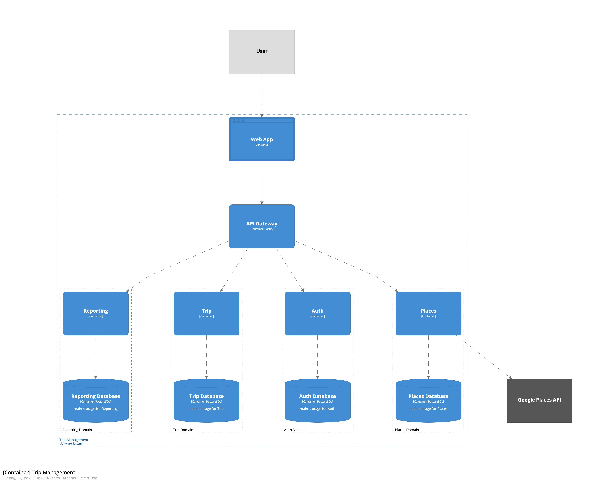

## System overview

The purpose of the Trip Management platform is to help users to manage and organize trips.

The platform will allow users to register accounts, manage trips, and creates reports.

## Structure

### The Trip Management platform is composed of the following subsystems.

1. [**Service A**](02_template.md) - TBD
2. [**Service B**](02_template.md) - TBD

### Interactions

The main relations between the internal subsystems are:

1. The **Service A** must provide ... to the **Service B**.
2. The **Service B** must provide ... to the **Service C**.

## Open topics

- 